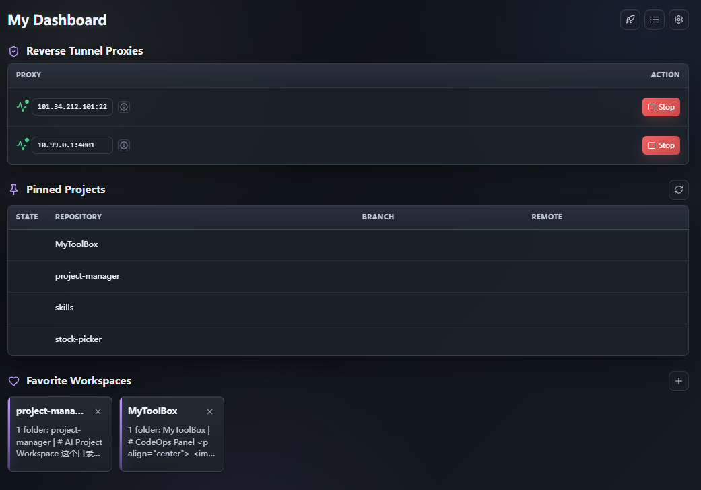

# CodeOps Panel 使用说明

<p align="center">
  
</p>

CodeOps Panel 是一个运行在 VS Code UI Host 侧的本地工作台扩展，用一个侧边栏面板集中管理常用开发运维入口。

- `Reverse Tunnel Proxies`：启动和停止 SSH 反向隧道（`ssh -N -R`）。
- `Pinned Projects`：查看重点 Git 仓库的分支、同步状态和工作区状态。
- `Favorite Workspaces`：收藏 `.code-workspace` 文件，并一键用新 VS Code 窗口打开。

## 界面截图

<p align="center">
  
</p>

## 快速开始

1. 安装扩展后，打开 Activity Bar 中的 `CodeOps Panel`。
2. 点击顶部 `Bootstrap`，按向导生成统一配置文件。
3. 如果已有配置，点击 `Settings` 打开或创建配置文件。
4. 配置完成后，在侧边栏中启动隧道、刷新重点项目状态，或添加常用 workspace。

默认配置文件路径是 `.vscode/mytoolbox.config.json`。你也可以通过 VS Code 设置 `myToolbox.configFile` 指向其他 JSON 文件。

## 功能说明

### Reverse Tunnel Proxies

- 在 `Reverse Tunnel Proxies` 区域逐行启动或停止多个远端隧道。
- 启动前会检查本机 `ssh` 命令是否可用。
- 远端端口占用时会显示明确错误。
- 支持在 Remote SSH 窗口中使用；SSH 进程仍运行在本地 UI Host。
- 扩展只停止由自身启动的隧道；检测到的外部隧道会显示为已启动，但不会被扩展停止。

### Pinned Projects

- 支持本地仓库和 SSH 远端仓库两种模式。
- 点击 `Refresh` 后刷新所有配置仓库。
- 展示 `clean` / `dirty`、`synced` / `ahead` / `behind` / `diverged` / `no upstream` 等状态。
- 点击项目行可查看详细 Git 状态输出。

### Favorite Workspaces

- 点击 `Add` 选择 `.code-workspace` 文件加入收藏。
- 点击卡片会用新 VS Code 窗口打开该 workspace。
- 卡片描述由 workspace folders 摘要和项目 README 首句自动生成。
- 卡片右上角可移除收藏。

## 交互说明

Activity Bar 图标：`CodeOps Panel`
视图名称：`CodeOps Panel`

分组：

- `Reverse Tunnel Proxies`
- `Pinned Projects`
- `Favorite Workspaces`

顶部工具栏：

- `Bootstrap`：用交互式初始化向导生成统一配置文件
- `Logs`：打开扩展输出日志
- `Settings`：打开/创建统一配置文件

`Reverse Tunnel Proxies` 表格行为：

- `Proxy`：显示状态图标、`remoteHost:remotePort` 和详情浮层入口
- `Action`：插件管理的 remote 可逐行 `Start` / `Stop`
- 外部已存在的 tunnel 显示为 `Started`，但不可从插件停止

`Pinned Projects` 表格行为：

- `Repo`：展示仓库显示名
- `Branch`：展示当前分支
- `Remote`：展示 upstream 同步状态
- `State`：展示 clean/dirty/unavailable
- `Refresh`：刷新全部配置仓库状态

`Favorite Workspaces` 卡片行为：

- `Add`：选择 `.code-workspace` 文件进入收藏
- 卡片主体：展示 workspace 名称和自动摘要
- 卡片点击：在新 VS Code 窗口打开 workspace
- 卡片右上角：移除该收藏

## 配置

扩展设置只保留 1 项：

- `myToolbox.configFile`（默认：`.vscode/mytoolbox.config.json`）

该设置指向整个插件的 JSON 配置文件路径。默认值是 workspace 级本地配置 `.vscode/mytoolbox.config.json`，通常不进入 Git。若为相对路径：本地窗口优先按工作区解析，Remote SSH 窗口按本地用户目录解析；若未命中，则回退到扩展内置 `resources/mytoolbox.config.json`。

配置文件同时包含 `ReverseTunnel`、`keyProjects` 和 `favoriteWorkspaces` 三个顶层节点：

```json
{
  "ReverseTunnel": {
    "sshPath": "ssh",
    "connectionReadyDelayMs": 1200,
    "localHost": "127.0.0.1",
    "localPort": 7897,
    "remotes": [
      {
        "remoteHost": "FOO_ADDRESS",
        "remotePort": 4001,
        "remoteUser": "FOO_USER",
        "remoteBindPort": 17897,
        "identityFile": ""
      }
    ]
  },
  "keyProjects": {
    "mode": "local",
    "rootDir": "E:/projects",
    "repoNames": ["MyToolBox", "another-project"],
    "sshTarget": "",
    "sshPort": 22,
    "gitPath": "git",
    "sshPath": "ssh"
  },
  "favoriteWorkspaces": {
    "workspaceFiles": []
  }
}
```

等价 SSH 命令：

```bash
ssh -N -p 4001 -R 17897:127.0.0.1:7897 FOO_USER@FOO_ADDRESS
```

### Settings

当 `myToolbox.configFile` 指向的文件不存在时：

1. 按当前设置值解析目标路径；如果设置未显式填写，则使用默认 `.vscode/mytoolbox.config.json`
2. 提供 `Create default config` 和 `Run bootstrap wizard` 两个选项
3. 选择默认配置时，在目标路径创建示例配置文件
4. 选择初始化向导时，按对话输入生成 `ReverseTunnel` 和 `keyProjects`
5. 自动更新 `myToolbox.configFile` 到该文件绝对路径并打开文件

### Bootstrap

Bootstrap 使用 VS Code 原生输入框逐步收集：

- Reverse Tunnel：`localHost:localPort`、零个或多个 remote 的地址/端口/用户名/绑定端口
- Pinned Projects：`local` 或 `ssh` 模式、SSH 目标（仅 SSH 模式）、`rootDir`、零个或多个 `repoNames`
- `local` 模式下 `rootDir` 使用文件夹选择器；`ssh` 模式下 `rootDir` 作为远端路径手动输入

若目标配置文件已存在，Bootstrap 会先确认是否覆盖；取消则不会修改文件。

## Pinned Projects 配置

字段说明：

- `mode`：`local` 或 `ssh`。非 `ssh` 值会按 `local` 处理。
- `rootDir`：项目根目录。`repoNames` 中的每一项会拼到该目录下；当 `repoNames` 包含 `"."` 时直接使用 `rootDir` 本身。
- `repoNames`：重点项目列表。
- `sshTarget`：SSH 模式下的目标，例如 `user@example.com`。
- `sshPort`：SSH 端口，默认 `22`。
- `gitPath`：本地模式使用的 Git 命令路径，默认 `git`。
- `sshPath`：SSH 模式使用的 SSH 命令路径，默认 `ssh`。

## Favorite Workspaces 配置

Favorite Workspaces 使用统一配置文件中的 `favoriteWorkspaces.workspaceFiles` 列表。

```json
{
  "favoriteWorkspaces": {
    "workspaceFiles": [
      "E:/projects/frontends.code-workspace",
      "E:/projects/backend-services.code-workspace"
    ]
  }
}
```

列表项保存 `.code-workspace` 文件路径。添加按钮会写入绝对路径；手动配置相对路径时，会按配置文件所在目录解析。

## 故障排查

- 看不到项目状态：确认 `keyProjects.rootDir` 和 `repoNames` 指向真实 Git 仓库。
- SSH 模式刷新失败：确认本机 `sshPath` 可执行、`sshTarget` 可登录、远端安装了 `git`。
- 隧道启动失败：检查远端端口是否被占用，以及本机 `localHost:localPort` 是否可连接。
- 配置文件打不开：检查 `myToolbox.configFile` 是否为有效路径；相对路径会按当前窗口类型解析。

## 限制说明

- 扩展不会管理非自身启动的 SSH 隧道。
- Pinned Projects 的 SSH 模式依赖远端 shell 和 Git 可用。
- `myToolbox.configFile` 是本地工作台配置，建议不要把包含私有主机或路径的个人配置提交到仓库。

## 更多信息

英文 Marketplace 说明见 `README.md`。

